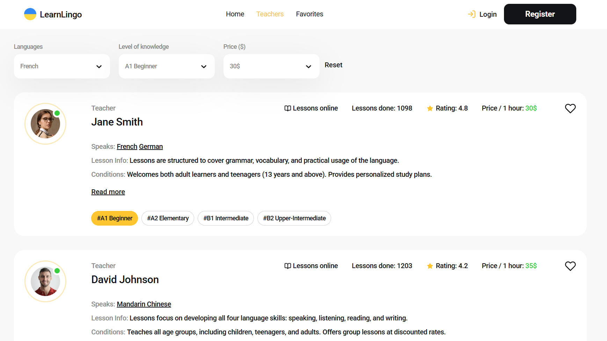
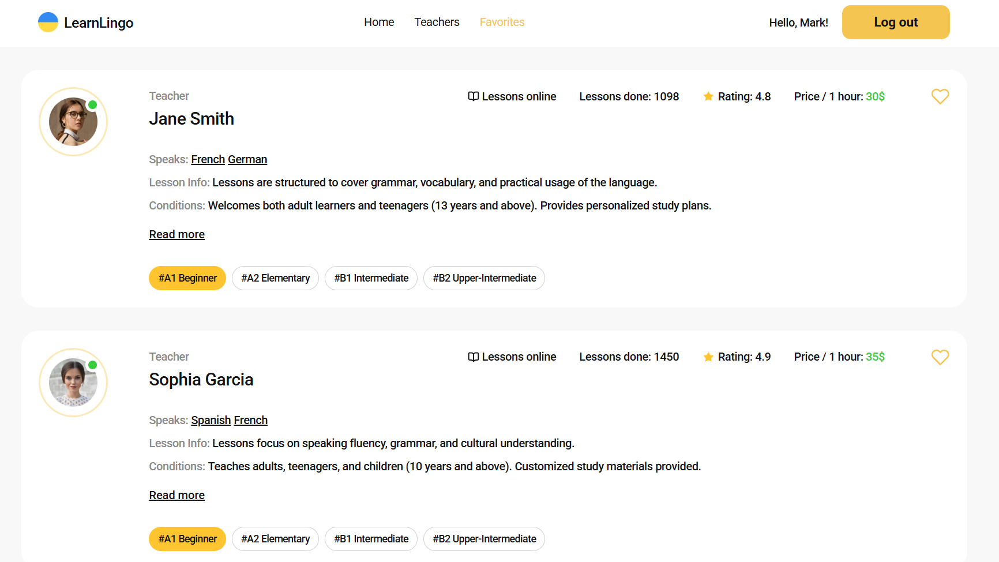
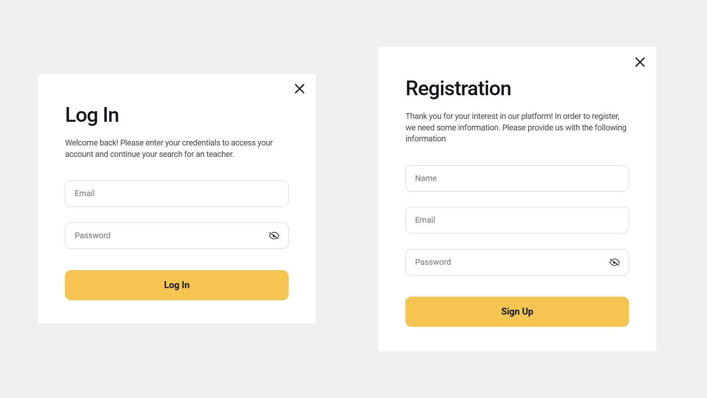
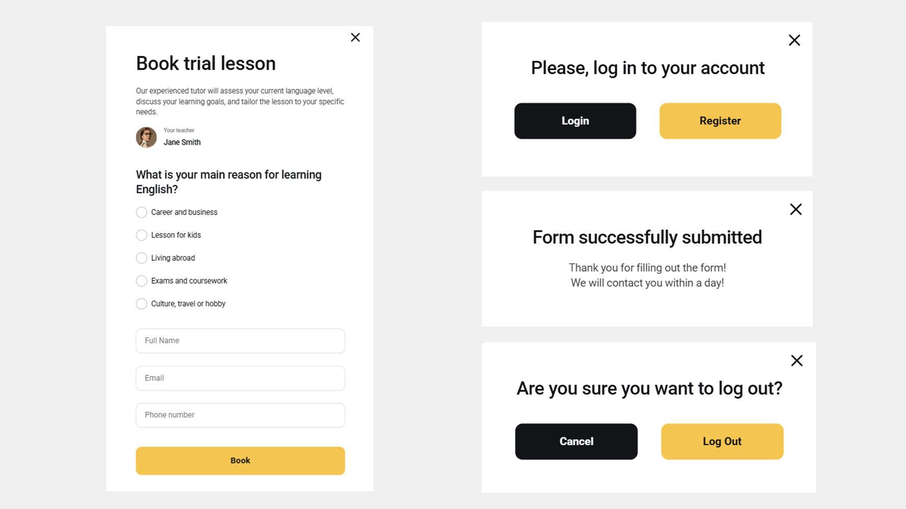

# 🗣️ Learn Lingo 

A web application for **Learn Lingo**, a service that connects students with professional online language teachers.
Users can explore teacher profiles, filter by language, level, or price, add favorites, and easily book trial lessons.

🔗 [Live Demo](https://learn-lingo-nine-ashy.vercel.app/)  

---

## ✨ Features
- 🏠 **Home page** with company benefits and a clear Get Started CTA leading to the teachers catalog


- 📑 **Teachers catalog** with:
  - filtering by language, student level, and price per hour
  - Load More button to fetch additional teachers from Firebase
  - “❤️” button to add/remove favorites (state saved after refresh)
  - Read more toggle for detailed teacher info and reviews



- 🚐 **Favorites page (private)**:
  - shows all saved teachers 
  - accessible only to authorized users



- 🚐 **Modals**:
  - **Login / Register** with validation (react-hook-form + yup)



  - **Book trial lesson** form with validation
  - **Extra dialogs**: success booking message, login info, mobile menu & filters, logout confirmation



---

- 🔗 Routing:  
  - `/` — Home page  
  - `/teachers` — Teachers page  
  - `/favorites` — Favorites page (private) 
  - `*` — Not Found Page

---

## 🛠️ Tech Stack
  - ⚡ Vite + React + TypeScript
  - 🔄 Redux Toolkit & redux-persist for state management
  - 🔐 Firebase (Authentication + Realtime Database)
  - 🌐 React Router v7 for routing & private routes
  - 🎣 react-hook-form + yup for forms and validation
  - 🎨 CSS Modules, clsx, modern-normalize
  - ✨ UI helpers: react-icons, react-hot-toast, react-select, react-responsive, react-spinners

---

## 🚀 Run Locally

1. Clone the repository:
   ```bash
   git clone https://github.com/sofi-dobriak/learn-lingo.git
2. Navigate to the project folder:
    ```bash
    cd learn-lingo
3. Install dependencies:
    ```bash
    npm install
4. Start the development server:
    ```bash
    npm run dev
5. Open in your browser:
    ```bash
    http://localhost:5173
---

## 💻 My other projects

### 🚐 Travel Trucks App

[Demo](https://travel-trucks-eosin-iota.vercel.app/) |
[Github](https://github.com/sofi-dobriak/travel-trucks)

---

👩‍💻 Author: Sofi Dobriak

